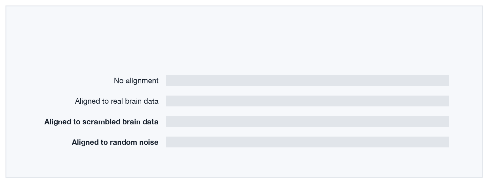
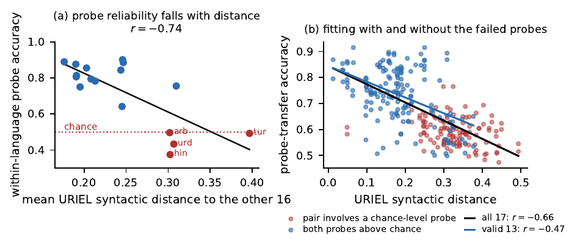
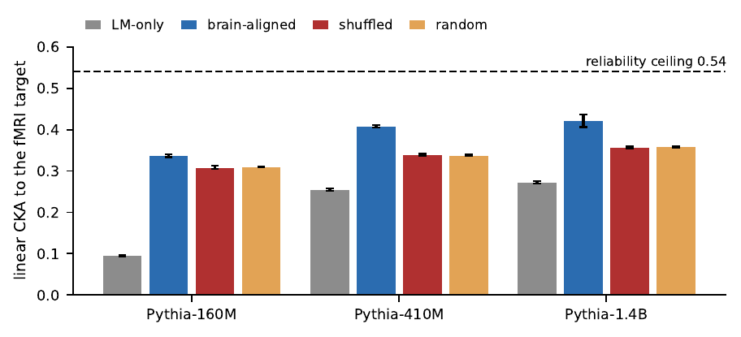

<p align="center">
  
</p>

<h1 align="center">The Score Is Not the Structure</h1>

<p align="center">
  <b>Brain alignment and cross-lingual transfer, audited</b><br>
  Code and results for the NeurIPS 2026 workshop paper
</p>

<p align="center">
  
  <a href="https://github.com/saman-rahbar/score-is-not-the-structure/actions/workflows/tests.yml"></a>
  
  <a href="LICENSE"></a>
</p>

<p align="center">
  <a href="#the-short-version">Overview</a> ·
  <a href="#quick-start">Quick start</a> ·
  <a href="#reproduce-the-paper">Reproduce</a> ·
  <a href="#data">Data</a> ·
  <a href="#citation">Citation</a>
</p>

---

## The short version

Researchers often claim that a model shares structure with something else, such
as the human brain or another language, and back the claim with a similarity
score. This paper asks a question that comes first: what does the score read
when the shared structure is missing, or when the tool that measures it does not
work?

We check two settings, and in both the score is not what it appears to be.

**Cross-lingual transfer.** A probe that tells grammatical from ungrammatical
sentences transfers worse between more distant languages, the usual evidence
for shared structure. But the probe itself fails along the same axis: it is no
better than guessing in four of seventeen languages, the most distant ones.
Counting the 272 language pairs as independent makes a null result look
strongly significant.

**Brain alignment.** Training a language model to match human brain responses
raises its similarity score from 0.095 to 0.337. A model trained on scrambled
brain data still reaches 0.309. Only a small part of the gain is specific to the
brain, and two unrelated targets already agree at about rank divided by sample
size before any model is trained.

The practical point: before asking whether a correspondence is useful, check how
much of the score would survive without it.

## Key numbers

| Cross-lingual study (XGLM-1.7B, 17 languages) | |
|---|:---:|
| Languages where the within-language probe is at chance | 4 of 17 |
| Transfer against typological distance, all languages | r = −0.66 |
| Same, after dropping the four chance-level languages | r = −0.47 |
| Steering result, p-value counting 272 pairs | 0.0006 |
| Same, counting 17 languages (the correct unit) | 0.155 |
| Steering along a language's own direction, over random | +6.21 nats, 16 of 17 |

| Brain-alignment study (Pythia-160M, 20 seeds) | CKA |
|---|:---:|
| No alignment | 0.095 |
| Aligned to real brain data | 0.337 |
| Aligned to scrambled brain data | 0.309 |
| Aligned to random noise | 0.310 |
| Reliability ceiling (agreement between two groups of people) | 0.540 |
| Scrambled target against real target, no model | 0.204 |
| Brain-specific gain, across 160M, 410M and 1.4B models | 0.028 to 0.068 |

## Figures

<p align="center">
  
</p>
<p align="center"><sub>The probe gets worse the more distant a language is, and fails in four languages. Dropping them halves the explained variance, but it also narrows the range of distances, and this sample cannot separate the two.</sub></p>

<p align="center">
  
</p>
<p align="center"><sub>Scrambled and random targets recover 83% to 92% of the brain-aligned score at every model size.</sub></p>

## Quick start

Every number in the paper that does not need a GPU reruns in about a minute from
the committed results.

```bash
git clone https://github.com/saman-rahbar/score-is-not-the-structure.git
cd score-is-not-the-structure
python -m venv .venv && source .venv/bin/activate
pip install -r requirements.txt

make check     # all CPU checks: robustness, probe validity, range restriction, bootstrap, CKA decomposition and floor
make figures   # both paper figures, written to figures/
```

`robustness.py` refuses to report anything until it re-derives the published
point estimates from `results.json`, so a broken install fails loudly.

## Reproduce the paper

### Cross-lingual transfer and steering (`crosslingual_agreement/`)

A logistic-regression probe reads XGLM-1.7B's middle layer at the agreeing verb
and is trained on MultiBLiMP minimal pairs for seventeen languages. For each
ordered pair of languages we measure transfer and steering, and regress both on
URIEL syntactic distance.

```bash
cd crosslingual_agreement
python experiment.py --sandbox   # synthetic self-test, no model or GPU
python experiment.py             # full run on a GPU; writes results.json
python robustness.py             # language-level permutation tests, probe-validity subset
python data_volume_check.py      # rules out training-set size behind the failed probes
python range_restriction.py      # range restriction against probe validity
python language_bootstrap.py     # confidence intervals with languages as the units
```

`range_restriction.py` reports the check that does not come out in our favour.
The four chance-level languages are also the four most distant, so dropping them
narrows the predictor. Of 2,380 possible four-language exclusions, only four are
as distant as the failing set, and three of those weaken the correlation as much.
The paper therefore reports the restricted correlation as what remains after
removing languages the probe cannot measure, not as the share caused by the
probe.

### Brain-geometry alignment (`brain_alignment/`)

Pythia models (160M, 410M, 1.4B) are fine-tuned on the Pereira et al. (2018)
sentences with an extra loss that pulls one hidden layer toward the fMRI
language-network responses, under four matched conditions: no alignment, real
target, scrambled target, and noise of the same rank.

```bash
cd brain_alignment
# 1) once, on a machine with internet access: build the fMRI target and noise ceiling
pip install brainscore_language          # needs mpi4py
python build_pereira.py --out cache/pereira_cache.npz
python build_pereira_noiseceiling.py --out cache/noise_ceiling.json

# 2) training runs (GPU)
export PEREIRA_NPZ=cache/pereira_cache.npz NOISE_CEILING_JSON=cache/noise_ceiling.json
EXP_MODEL=EleutherAI/pythia-160m EXP_SEEDS=20 python experiment.py
EXP_MODEL=EleutherAI/pythia-410m EXP_SEEDS=8 EXP_MAIN_ONLY=1 python experiment.py
python pretrained_blimp.py               # BLiMP with no fine-tuning, as an anchor

# 3) analysis (CPU)
python cka_decomposition.py --results-dir results
python cka_floor.py                      # CKA between targets, with no model
python cka_floor.py --rank 64            # the floor tracks rank over sample size
```

`cka_floor.py` gives 0.0505, 0.1019, 0.2040 and 0.4088 at ranks 32, 64, 128 and
256, against rank divided by the 627 sentences of 0.0510, 0.1021, 0.2041 and
0.4083. Anyone scoring against a rank-reduced target can compute this floor in
advance.

## Data

- **Pereira et al. (2018)** fMRI responses through the Brain-Score language
  package (`brainscore_language`), language-network voxels, pooled across
  participants and reduced to rank 128.
- **BLiMP** (`nyu-mll/blimp`) and **MultiBLiMP** (`jumelet/multiblimp`) through
  Hugging Face `datasets`.
- **URIEL / lang2vec** syntactic features (`syntax_knn`), cosine distance.

On clusters whose compute nodes have no internet access, download models and
datasets on a login node first. The scripts switch Hugging Face to offline mode
and stop with an error if a cache is missing. All models load in fp32, seeds are
fixed, and a diverged run is reported as NaN rather than as 0.

## Repository layout

```
crosslingual_agreement/
  experiment.py              probe transfer and steering across 17 languages
  robustness.py              language-level permutation tests, probe-validity subset
  data_volume_check.py       training-set size against probe failure
  range_restriction.py       range restriction against probe validity
  language_bootstrap.py      confidence intervals that resample languages, not pairs
  results/results.json       all 272 pairs, distances and per-language accuracies
brain_alignment/
  experiment.py              four-condition fine-tuning, BLiMP, CKA, sweeps
  cka_decomposition.py       brain-specific gain over the scrambled and noise controls
  cka_floor.py               CKA between targets with no model, by rank
  build_pereira.py           builds the fMRI target
  build_pereira_noiseceiling.py   subject-split reliability ceiling
  pretrained_blimp.py        BLiMP with no fine-tuning
  results/                   per-seed results for all three model sizes
make_figures.py              both paper figures from the committed results
tools/make_hero.py           the animation at the top of this page
```

## Citation

```bibtex
@inproceedings{rahbar2026score,
  title     = {The Score Is Not the Structure: Brain Alignment and Cross-Lingual Transfer},
  author    = {Rahbar, Saman},
  booktitle = {NeurIPS 2026 Workshop on Linguistic Principles for Foundation Models (LP4FM)},
  year      = {2026}
}
```

## License

MIT. See [LICENSE](LICENSE). The datasets keep their own licenses and terms of
use.
